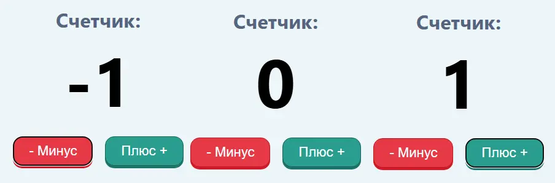

# React Counter

 

    
    

 

A simple counter implemented in React.

## Technologies and Libraries

- **React** 
- **Create React App** 
- **Sass** 
- **@testing-library/react**, **@testing-library/jest-dom**, **@testing-library/user-event** 

## Project Structure

- App.js — the main counter component
- index.js — the entry point of the application
- index.scss — application styles
- index.html — HTML template

## Scripts

- `npm start` — starts the application in development mode
- `npm run build` — builds the application for production
- `npm test` — runs tests
